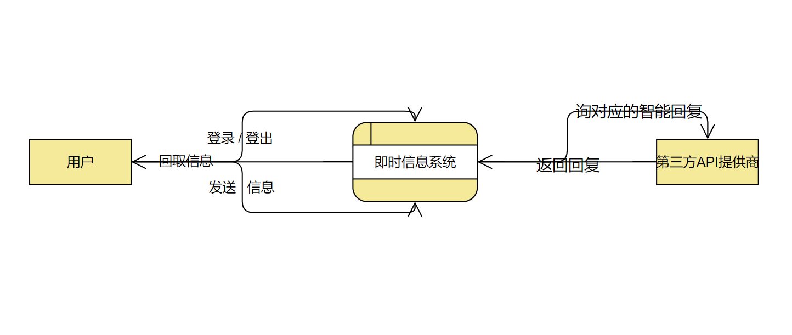
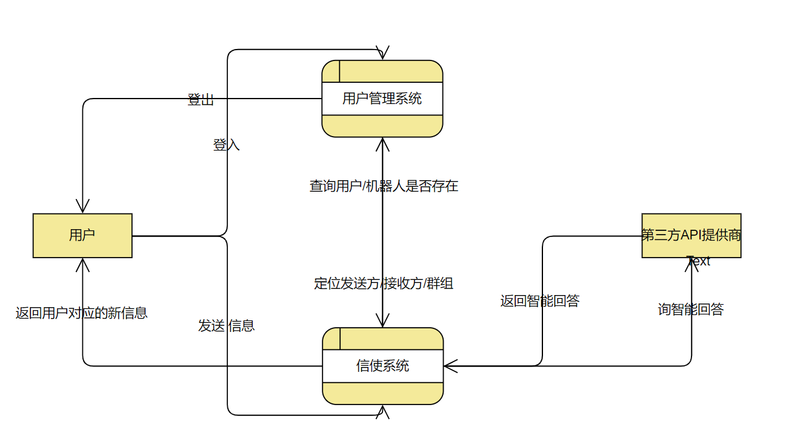
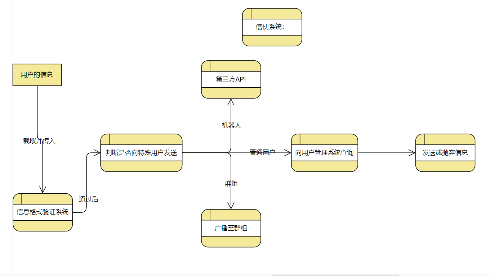
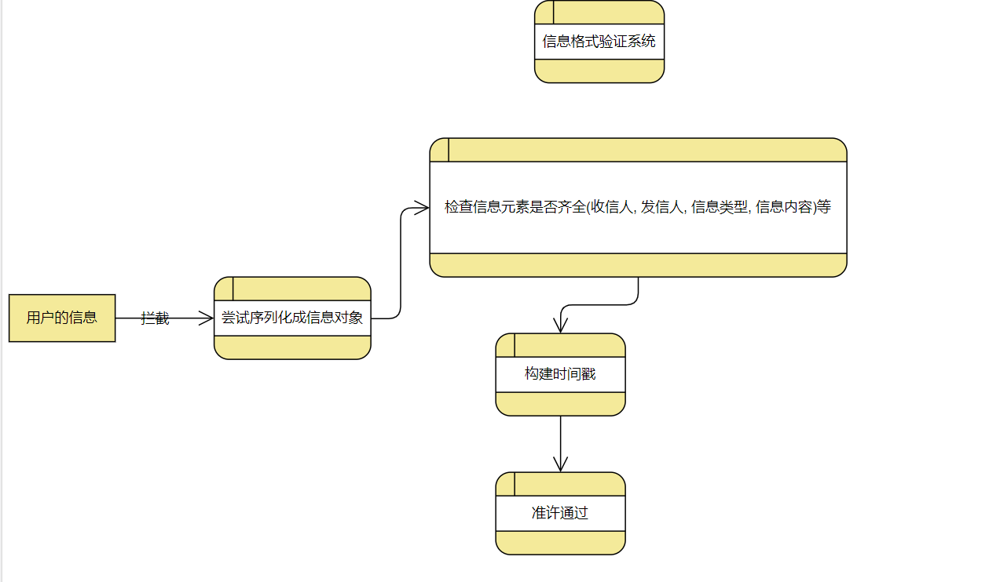
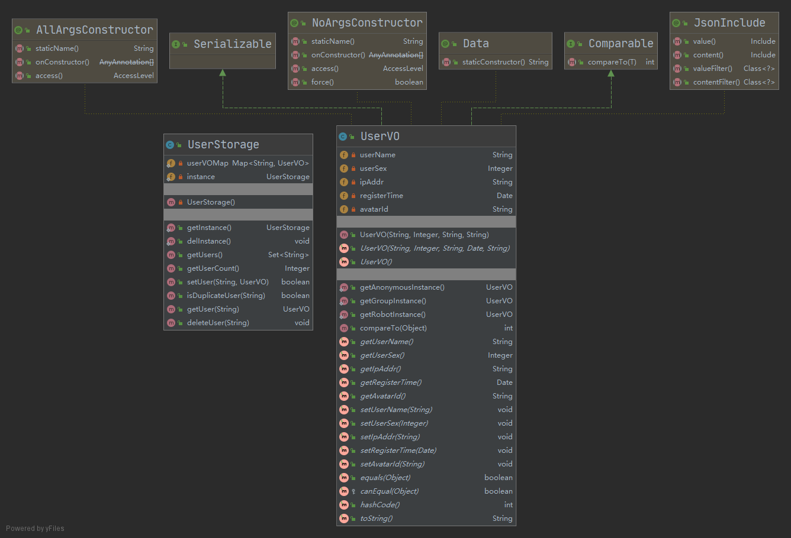
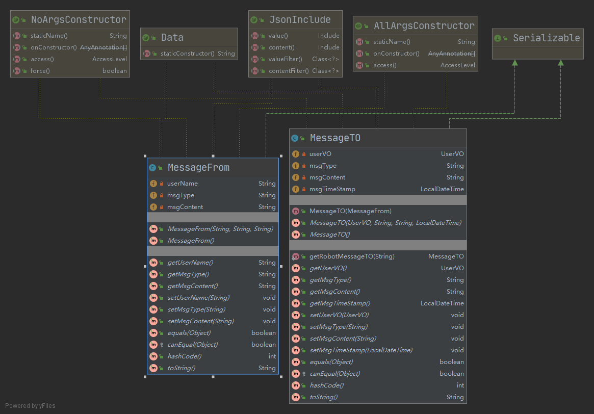
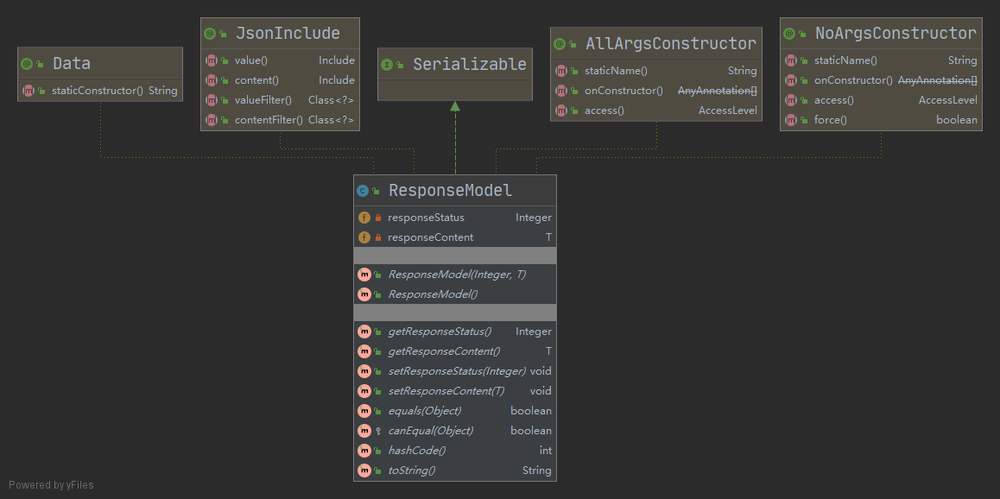
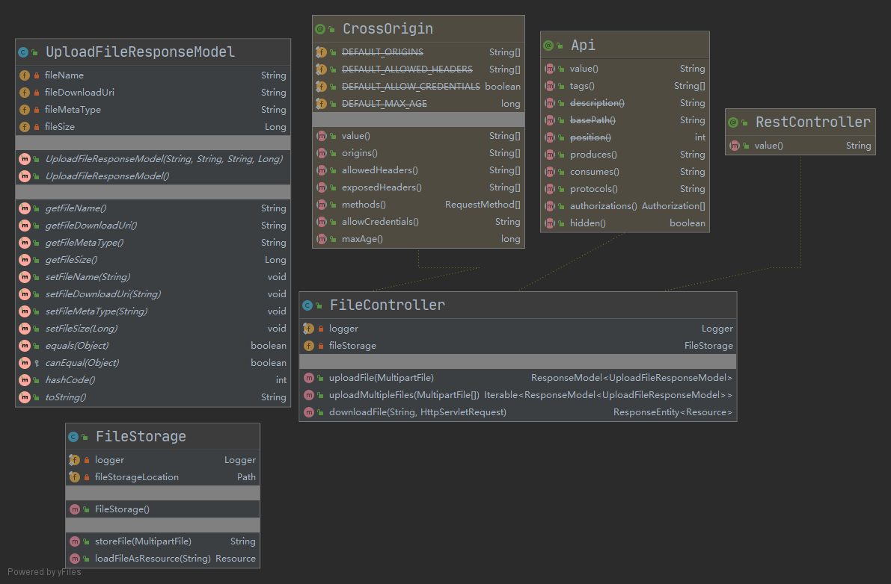
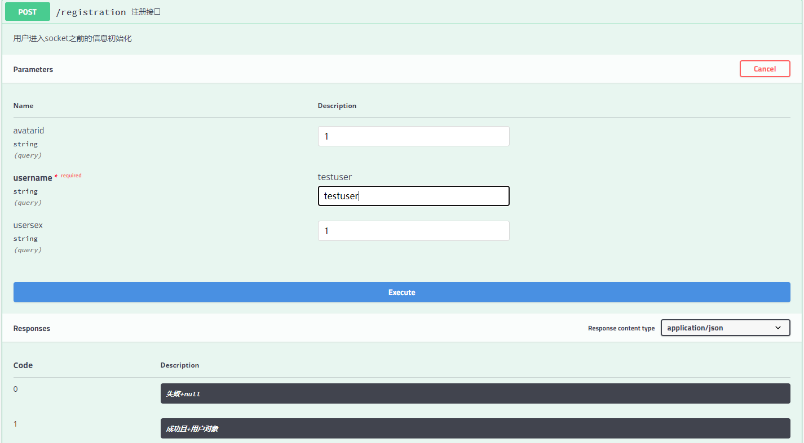
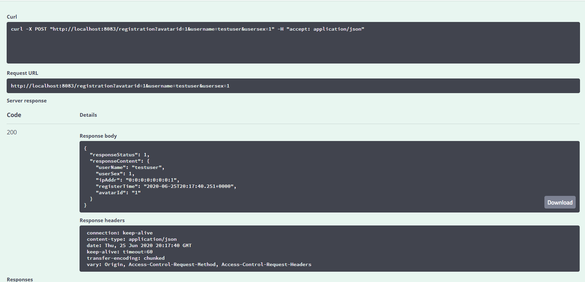

[toc]

# 《软件工程与方法学》实验报告

### ————网络即时信息系统的系统分析设计

17信科1班     陈浩骏   杨逸飞   熊明钊   田鑫

___

# 一、项目开发计划

## 1.1 引言

### 1.1.1  编写目的

​    为了网页端与服务端可以实现高效的即时通信，摒弃传统的异步请求频繁轮询服务器，本次实验采用Websocket交互，减少服务器带宽以及响应时间的开销。

​    传统的网页端即时信息系统的运行方式往往是使用定时器轮询服务器，回取自己是否有新消息的服务器应答，但是在该种环境下，每一次的请求都需要建立一次有效的TCP连接 (因HTTP 1 无状态的原因)。握手建立连接的时间虽然很短，但是在服务器承受流量压力时，往往是不可取的，会耗费许多不必要的时间。因为即时信息系统的特殊性决定了它需要有状态的，服务端可以主动发送信息给客户端的几个需求，所以采用Websocket可以减少服务器在应对高并发时的流量以及资源压力。

### 1.1.2 项目背景

​    初定以微信的移动端作为前端设计的蓝图，后端采用RESTful风格构造接口与前端交互，系统开发阶段采用前后端分离开发，开发过程中，后端开发需暴露接口给予前端进行调试，前端以后端的导向开发，后端在实现基础通信需求后，采用极限编程开发策略。在上线前进行前后端资源整合并打包服务上云。

## 1.2 项目概述

### 1.2.1 工作内容

+ 后端先进行基于Websocket的开发，与前端测试即时信息系统基于该协议的可行性，做一个小型测试。
+ 确定可行后，后端开始着手开发基于用户模块的拓展，以及群组消息模块的拓展，并撰写接口文档和构建后端测试demo以及测试环境供前端进行调试与基本样式开发。
+ 前端设计出基本样式后，与团队人员商议样式与美观设计，手绘或表达设计大致成品样式，并着手样式开发。
+ 后端进入极限编程开发阶段，根据新需求构建新功能与新接口文档，尽最大可能不改写或重写原有接口，保证前端开发的代码可行性。
+ 项目成品进行基准测试，压力测试，非法输入输出测试等白盒测试途径后，给予测试成员测试版本进行“模拟黑盒测试”，尽最大可能模拟用户可能触发的操作，以捕捉异常进行“修补处理”。

### 1.2.2 主要参加人员

| 人员   | 职责                                             |
| ------ | ------------------------------------------------ |
| 杨逸飞 | 前端总负责、前端逻辑交互与数据通信               |
| 熊明钊 | 前端风格样式与美学设计                           |
| 陈浩骏 | 后端总负责、后端服务及接口开发、服务整合上云部署 |
| 田鑫   | 项目测试、接口非法输入输出与压力测试             |

### 1.2.3 产品

#### 1.2.3-1 程序

+  后端分离时采用Maven对Spring Boot项目的Jar打包方式，部署环境要求为Java11或以上。
+ 前端分离时采用Npm进行项目依赖解决与打包整合。
+ 前后端整合时采用放置前端打包dist进入Spring Boot静态资源文件路径内，打包成Jar包部署。
+ 上云时，将会给予域名/地址。

#### 1.2.3-2 文档

​    因该项目是采用后端导向前端开发，故在Spring Boot内整合了Swagger2以进行接口文档自动生成，详情于程序运行时的输出(Swagger2 Auto Generated API Document)。

### 1.2.4 验收标准

+ 能够准确无误的收取和发送即时信息
+ 在服务端与客户端之间的通信采用全双工的WS协议
+ 服务上云后保证可用性

### 1.2.4 完成项目的最迟期限

​    **2019-2020学年第二学期第18周教学周周五** 


# 二、需求说明

## 2.1 引言

### 2.1.1 目的

​    该文档是关于用户对于网上招聘系统的功能和性能的要求，重点描述了即时信息系统的功能需求，是概要设计阶段的重要输入。

​    本文档的预期读者是

+ 设计人员
+ 开发工具
+ 项目管理人员
+ 测试人员

### 2.1.2 范围

​    该文档是借助于当前系统的逻辑模型导出目标系统的逻辑模型的，解决整个项目系统的“做什么”的问题。在这里，没有涉及开发技术，而主要是通过建立模型的方式来描述用户的需求，为开发协助方提供信息。


## 2.2 系统定义

### 2.2.1 方向

​    本系统旨在为用户提供即时信息的环境，主要应用场景依从于主网站，为主网站提供实时咨询服务，当然也可做为独立服务运行，为用户提供非持久化的，简化的信息交流讨论空间。

### 2.2.2 目标

+ 系统能够提供友好的用户界面，并且主要为移动端页面进行优化
+ 系统具有良好的运行效率，能够尽量减少系统需要进行冷重启的次数
+ 系统需具有良好的模块化开发特性，减少模块之间的耦合程度，方便后期加入功能的优化

### 2.2.3 流程

```sequence
Title: 图1：基本流程
客户端->服务端:声明用户名，注册
客户端->服务端:用户发送信息
Note left of 客户端: 客户端为移动平台[手机/平板]
服务端->客户端:根据用户发送其新信息
客户端->服务端:发送群组信息
服务端->客户端:广播群组信息
客户端->服务端:向机器人发送信息
服务端->第三方API提供商:询机器人智能回复
第三方API提供商->服务端:回取智能回复
服务端->客户端:发送智能回复
客户端->服务端:...
服务端->客户端:...
```

## 2.3 环境

### 2.3.1 服务器运行环境

+ CPU: 1.0GHz及以上单核/多核处理器
+ 内存: 512MB及以上
+ 硬盘: 2GB及以上可用空间，无持久化储存，仅作临时存储用户发送的文件
+ 系统: Linux/Windows

### 2.3.2 客户端运行环境

+ 移动端尺寸: 手机，平板
+ 浏览器内核: 对移动端Chrome, Firefox, Safari, 主流安卓阵营系统浏览器(Huawei, Xiaomi, Meizu, Oppo, Vivo等)

### 2.3.3 几点说明

1. 因为该项目参照聊天室开发目的，不提供用户持久化储存，用户也不需要安装任何软件或依赖；浏览器即来即用，输入用户名就可以进入聊天系统，故没有对用户等特征信息进行建表建库，仅记录用户IP地址为用户资料。
2. Web资源服务器采用Spring Boot提供的Tomcat Build-in，方便打包上云部署。截至当前开发使用Spring Boot版本为2.2.7-RELEASE，内置Tomcat-9.0.34。


# 三、概要设计说明

## 3.1 流程及抽象模块设计

### 3.1.1 流程设计










### 3.1.2 数据模块设计

#### 3.1.2-1 用户及用户存储模块设计

+ 用户对象

| 数据标识      | 数据特征                  | 数据用途                                             |
| ------------- | ------------------------- | ---------------------------------------------------- |
| <u>用户名</u> | 字符串                    | 主键，用于鉴别用户，因此不可出现相同用户名           |
| 用户性别      | 位(Bit, 0或1)             | 多元化用户信息                                       |
| 用户ip地址    | 字符串                    | 便于后台查看或记录，不需提交，由Servlet可直接获取    |
| 用户登入时间  | 字符串(前端)/Java类(后端) | 便于清理长时间idle的用户，不需提交，由对象构建时生成 |
| 用户头像      | 整数                      | 提供头像模组标识                                     |

+ 用户储存

| 数据标识 | 数据特征              | 数据用途                                       |
| -------- | --------------------- | ---------------------------------------------- |
| 储存实例 | Map<用户名，用户对象> | 方便用户管理系统以用户名取到用户对象并进行鉴别 |

#### 3.1.2-2 信息发送/接受模板设计

+ 客户端 -> 服务端 的信息模板

| 数据标识   | 数据特征                     | 数据用途                                            |
| ---------- | ---------------------------- | --------------------------------------------------- |
| 目标用户名 | 字符串                       | 信息的去处(可以用PathVariable代替)                  |
| 源用户名   | 字符串                       | 标识自己，让目标用户能识别到是发送方                |
| 信息类型   | 整数                         | 缺省为1，表示普通文字信息，后续可添加，便于前端开发 |
| 信息内容   | 字符串/多媒体内容(Multipart) | 信息内容                                            |

+ 服务端 -> 客户端 的信息模板

| 数据标识 | 数据特征                  | 数据用途                                               |
| -------- | ------------------------- | ------------------------------------------------------ |
| 源用户   | 用户对象                  | 拿到用户对象的所有特征                                 |
| 信息类型 | 同上                      | 同上                                                   |
| 信息内容 | 同上                      | 同上                                                   |
| 时间戳   | 字符串(前端)/Java类(后端) | 信息时间戳，不需提供，信息在转换过程中自动生成戳(后端) |

#### 3.1.2-3 返回数据的模块设计

> 该模块用于承载所有非信息类数据的前后端通信数据，基于RESTful，构造具有泛型参数的对象

| 数据标识       | 数据特征 | 数据用途                                                     |
| -------------- | -------- | ------------------------------------------------------------ |
| 返回状态       | 整数     | 类似用途为HTTP状态码，对于不同的查询结果返回不同的数值，让前端不需频繁对返回body进行类型判断 |
| 返回内容(body) | 泛型对象 | 返回的body                                                   |

## 3.2 抽象接口设计

#### 3.2.3-1 用户登入接口抽象设计

| 传入参数 | 参数类型 | 是否必须/ 是否存在默认（缺省）值 |
| -------- | -------- | -------------------------------- |
| 用户名   | 字符串   | 必须                             |
| 头像id   | 整数     | 非必须，缺省为1                  |
| 性别     | 整数     | 非必须，缺省为0                  |

传出结果 -> 布尔值（是否登入成功）

#### 3.2.3-2 用户登出接口抽象设计

> 无参无返回接口，实现完内部注销用户方法后销毁连接

#### 3.2.3-3 用户数量查询接口抽象设计

> 无参接口

传出结果 -> 上述用户储存对象的Map的大小

#### 3.2.3-4 用户列表接口设计

>分两类：用户带序接口(已排序)， 非排序

传出结果 -> 带拼音首字母的有序用户列表 或 无序的用户KeySet(因用户储存对象的实例采用的是Map储存)

#### 3.2.3-5 信使接口设计

> 无返回接口，接口内直接发送信息给有效接收方或丢弃信息

| 传入参数 | 参数类型                               | 是否必须/ 是否存在默认（缺省）值 |
| -------- | -------------------------------------- | -------------------------------- |
| 目标用户 | Path Variable                          | 必须                             |
| 信息     | 客户端 -> 服务端 的信息模板(见3.1.2-2) | 必须                             |

#### 3.2.3-6 信使(群组)接口设计

> 与4.3.5处相同，接口内直接广播信息至全局

#### 3.2.3-7 信使(机器人)接口设计

> 与4.3.5处相同，接口内将询第三方api接口回取消息后将目标用户设为源用户，生成标准信息模板(4.2.2中服务端 -> 客户端 的信息模板)后发送

#### 3.2.3-8 文件上传接口设计

| 传入参数 | 参数类型   | 是否必须/ 是否存在默认（缺省）值 |
| -------- | ---------- | -------------------------------- |
| 文件     | 多媒体文件 | 必须，可以是多个以表单上传       |

传出结果 -> 随机化后的，可以被用户直接访问到资源识别符(URI)，以不同的信息类型伴随信息发送

## 3.3 抽象界面交互逻辑设计

> 前端使用Vue开发，构造针对移动端优化的单页应用，其逻辑实现基于页面路由与模板渲染。

抽象要素：

+ 底部导航栏

+ 登陆欢迎页
  - 采集上述登入接口需要的信息(用户名，性别，头像)
+ 用户列表页
  - 显示当前在线的用户，并为聊天页提供页面路由参数

+ 聊天页
  - 提供发送界面以及基本信息，当前发送给谁，输入框，提交/发送按钮等
+ “我”个人信息页
  - 用于显示我的信息与关于我的注销/登出逻辑实现

## 3.4 抽象界面内部逻辑设计

### 3.4.1 建立Websocket连接

​    利用STOMP的客户端js库依赖，在登陆后与服务器建立websocket通信。

### 3.4.2 监听服务端反馈回的实时信息

​    利用已经建立好的STOMP连接(本质上是基于sockjs的)，监听后端给出的信息终端。

+ 监听自己用户名的信息终端，以收到接受方是自己的信息。
+ 监听群组信息，接受服务端的广播信息。

### 3.4.3 刷新用户列表

​     刷新时机一般选取以下情况触发后

+ 用户新登入，进行全量刷新
+ 从聊天界面返回，再次进入用户列表页面路由时
+ 设计的倒计时轮询，强制全量刷新

### 3.4.4 发送消息

​    由用户列表点击进入聊天界面后，当前页面可以取到需要发送的用户名，发送将打包好一个信息模板（见3.1.2-2）由上述建立的websocket连接渠道发送。

# 四、详细设计说明

## 4.1 抽象对象模块的实现

#### 4.1.1 用户对象的实现

> 抽象类见3.1.2-1



#### 4.1.2 信息对象的实现

> 抽象类见3.1.2-2



#### 4.1.3返回数据对象的实现

> 抽象类见3.1.2-3，本工程基于RESTful返回的信息都必须严格遵守该类规范



```java
@Data
@AllArgsConstructor
@NoArgsConstructor
@JsonInclude(JsonInclude.Include.NON_NULL)
public class ResponseModel<T> implements Serializable {
    private Integer responseStatus;
    private T responseContent;
}
```


## 4.2 抽象接口的实现

### 4.2.1 用户登入登出接口实现

> 该实现位于一个RestController中

```java
    @ApiOperation(value = "注册接口", notes = "用户进入socket之前的信息初始化", produces = "application/json")
    @ApiImplicitParams({
            @ApiImplicitParam(name = "username", required = true, value = "testuser"),
            @ApiImplicitParam(name = "avatarid", required = false, defaultValue = "1"),
            @ApiImplicitParam(name = "usersex", required = false, defaultValue = "1")
    })
    @ApiResponses({
            @ApiResponse(code = 1, message = "成功且+用户对象"),
            @ApiResponse(code = 0, message = "失败+null")
    })
    @PostMapping(value = "/registration", produces = "application/json")
    public ResponseModel<UserVO> register(@RequestParam(value = "username", required = true) String userName,
                                          @RequestParam(value = "avatarid", required = false, defaultValue = "1") String avatarId,
                                          @RequestParam(value = "usersex", required = false, defaultValue = "1") String userSex,
                                          HttpServletRequest httpServletRequest) {
        logger.info("Handling registration, userName-> {}", userName);
        if (StringUtils.isEmpty(userName) || userName.length() < 2) {
            return new ResponseModel<>(0, null);
        }
        UserVO userVO = new UserVO(userName, Integer.parseInt(userSex), httpServletRequest.getRemoteAddr(), avatarId);
        boolean isSuccess = UserStorage.getInstance().setUser(userName, userVO);
        if (isSuccess) {
            simpMessagingTemplate.convertAndSend("/topic/messages/system", new SystemTO("11", userName));
            return new ResponseModel<>(1, userVO);
        }else {
            return new ResponseModel<>(0, userVO);
        }
    }

    @ApiOperation(value = "用户下线", notes = "退出系统, 未作身份验证！")
    @ApiImplicitParam(name = "username", required = true, value = "testuser")
    @ApiResponses({
            @ApiResponse(code = 1, message = "成功"),
            @ApiResponse(code = 0, message = "失败未知错误")
    })
    @GetMapping("/logout")
    public ResponseModel<String> logoutSystem(@RequestParam("username") String userName) {
        boolean isUserExists = UserStorage.getInstance().isDuplicateUser(userName);
        if (isUserExists) {
            UserStorage.getInstance().deleteUser(userName);
            logger.info("Handling Logout, userName-> {}", userName);
            simpMessagingTemplate.convertAndSend("/topic/messages/system", new SystemTO("12", userName));
            return new ResponseModel<>(1, "Success");
        }else {
            return new ResponseModel<>(0, "Unexpected Failure");
        }
    }
```

### 4.2.2 用户数量查询接口的实现

> 该实现位于一个RestController中

```java
    @ApiOperation(value = "用户计数", notes = "返回计数")
    @GetMapping("/getusercount")
    public String getUserCount() {
        String count = UserStorage.getInstance().getUserCount().toString();
        logger.info("Handling Counting, Count users -> {}", count);
        return count;
    }
```

### 4.2.3 用户列表接口的实现

#### 4.2.3-1 无序的用户列表接口

> 该实现位于一个RestController中

```java
    @ApiOperation(value = "用户列表", notes = "返回所有用户用户名的列表")
    @GetMapping("/fetchAllUsers")
    public Set<String> fetchAll() {
        return UserStorage.getInstance().getUsers();
    }
```

#### 4.2.3-2 有序的用户接口列表

```java
//获取用户名的首字母
public class PinYinUtil {
    public static String getHeadPinYin(String word) {
        StringBuffer headPinyin = new StringBuffer();
        Character firstChar = word.charAt(0);
        String[] pinYinArray = null;
        if (firstChar > 128) {
            pinYinArray = PinyinHelper.toHanyuPinyinStringArray(firstChar);
            if (pinYinArray != null) {
                headPinyin.append(pinYinArray[0].charAt(0));
            } else {
                headPinyin.append("#");
            }
        } else {
            if (Character.isLetter(firstChar)) {
                headPinyin.append(firstChar);
            }else {
                headPinyin.append("#");
            }
        }
        return headPinyin.toString().toUpperCase();
    }
}

//生成有序列表
@Data
public class OrderedContactModel {
    private TreeMap<String, List<UserVO>> contactMap;

    public OrderedContactModel() {
        this.contactMap = new TreeMap<String, List<UserVO>>();
        Set<String> nameSet = UserStorage.getInstance().getUsers();
        for (String name : nameSet) {
            String firstPinyin = PinYinUtil.getHeadPinYin(name);
            if (!contactMap.containsKey(firstPinyin)) {
                ArrayList<UserVO> tmpArray = new ArrayList<UserVO>();
                tmpArray.add(UserStorage.getInstance().getUser(name));
                contactMap.put(firstPinyin, tmpArray);
            } else {
                contactMap.get(firstPinyin).add(UserStorage.getInstance().getUser(name));
            }
        }
        for (List<UserVO> voList : contactMap.values()) {
            Collections.sort(voList);
        }
    }
}
	//在RestController中返回
    @ApiOperation(value = "返回有序用户列表", notes = "带有拼音首字母的用户名列表, 缺省用#")
    @GetMapping("/fetchAllUsersWithOrder")
    public ResponseModel<OrderedContactModel> fetchWithOrder() {
        return new ResponseModel<>(1, new OrderedContactModel());
    }
```

### 4.2.4 信使接口的实现

> 该类被RestController修饰，且SimpMessagingTemplate会发送并转换信息
>
> 普通用户，群组，机器人

```java
@RestController
public class MessageController {

    private static Logger logger = LoggerFactory.getLogger(MessageController.class);

    @Autowired
    private SimpMessagingTemplate simpMessagingTemplate;

    @Autowired
    private CallRobotExternalApi callRobotExternalApi;

    @MessageMapping("/chat/{to}")
    public void sendMessage(@DestinationVariable String to, MessageFrom from) {
        logger.info("Handling imcoming message {} -> {}", from.getUserName() , to);
        boolean isExists = UserStorage.getInstance().isDuplicateUser(to);
        if (isExists) {
            logger.info("Successfully deliver message -> {}", to);
            simpMessagingTemplate.convertAndSend("/topic/messages/" + to, new MessageTO(from));
        }else {
            logger.warn("Destination username {} not exist/online, check username", to);
        }
        return;
    }

    @MessageMapping("/chat/GROUP")
    public void sendGroupMessage(MessageFrom from) {
        logger.info("Handling incoming group message {} -> GROUP", from.getUserName());
        simpMessagingTemplate.convertAndSend("/topic/messages/GROUP", new MessageTO(from));
        return;
    }

    @MessageMapping("/chat/ROBOT")
    public void sendRobotMessage(MessageFrom from) {
        logger.info("Handling incoming robot message from {}", from.getUserName());
        robotSendMessage(from);
        return;
    }

    public void robotSendMessage(MessageFrom from) {
        String robotReply = callRobotExternalApi.getRobotReply(from.getMsgContent());
        logger.info("Robot message callback {}", robotReply);
        simpMessagingTemplate.convertAndSend("/topic/messages/" + from.getUserName(), MessageTO.getRobotMessageTO(robotReply));
        return;
    }
}
```

### 4.2.5 文件上传下载接口实现

> 涉及IO代码量较大，且该功能与该工程耦合度相对较低，不予展示代码，仅需post接文件并返回一个可以访问的链接即可



## 4.3 抽象界面交互逻辑的实现

### 4.3.1 界面交互汇总

|     组件名     | 功能                                                         | 用到api及主要实现                                            |
| :------------: | ------------------------------------------------------------ | ------------------------------------------------------------ |
|    App.vue     | vue挂载的最外层的组件，使用render函数将App组件渲染到DOM上，同时自定义一个提示信息，提示新用户上线和下线状态 | 通过subscribe("/topic/messages/system“)实时获取用户上线和注销，将服务器返回的数据(实际为xxx用户上下线)存在vuex的state变量中(vue用来管理公共状态变量的库)，在App中通过vue的watch方法来监听变量变法来实时渲染到DOM中并触发js中的定时器实现弹窗效果 |
|    Home.vue    | 登陆注册界面，主要负责实现用户登录                           | 用户通过选择头像(默认性别)，输入姓名，按下对应的登录按钮或者手机键盘的enter事件来触发登陆点击事件，通过axios框架发送POST网络请求后端的/registration接口，从而获取返回的信息，包括返回状态码，用户姓名，性别，头像ID，ip，因为后面的操作会用到这些数据，所以将数据保存在之间提到的vuex state公共变量。 (通过在axios框架中设置拦截器 当code===1 注册成功 允许返回数据 路由跳转到用户主界面) |
|    User.vue    | 用户主界面，主要作用是提供路由跳转，也就是用户页面的切换     | 用户界面主要包括屏幕底部的tabbar功能，每个小图标代表一个页面 点击会实现相应的跳转，在这之前通过在vue-router中注册的三个path对应着三个组件所指向的路由，我们通过vue特有的mounted钩子函数(在组件渲染到DOM后)实现早先在utils中封装好的websocket.js 向服务器发起websocket连接，并订阅三个不同组(自己、system、group)，其中订阅自己 用来接收别人发给自己的消息(事实上时接收服务器传过来的数据)，system用来获取新用户上下线消息，group用于群聊。最后将url push到用户好友裂变，因为我们不希望在切换三个不同界面频繁重新渲染，所以我们使用keep-alive 保证切换路由时 组件不会被频繁销毁 创建。 |
|  Userlist.vue  | 用户联系人目录，实现在线人数以及点击跳转聊天室功能           | 用户联系人页面第一步当然是获取用户数据，通过axios 发起get请求，从后台/getusercount 和 /fetchAllUsersWithOrder 分别获取在线人数 和 用户分布情况，其中用户分布情况 已经拿到了按姓名排好序的用户组， 拿到数据后 我们依然将他们设为公共变量 方便组件间的通信，按照获取的所有对象的名字、头像ID，将他们渲染到网页中 对于每个好友 我们需要添加点击事件， 当点击该用户时会立马跳转到与该对象的聊天框 只是在跳转的时候 我们将聊天对象的姓名 头像id 作为query string加到url里面 一起跳转 方便在聊天室里面获取响应对象的头像和姓名。最后，我们还要监听此时用户在线人情况 如果有用户下线 上线 我们需要重新执行refreshonline方法 以获取最新的用户情况 。而且在每次从别的页面跳转到当前页面的，也必须触发一次refresh操作，为的是第一次进入的也会实时刷新用户列表信息 |
|  Userchat.vue  | 用户聊天界面，主要用于用户发送消息                           | 聊天页面主要包含三部分，第一个是head里面放的是聊天对象的姓名，第二个是对话框(我们这里采用子组件chatroom来渲染，因为如果渲染到一个页面中会显得十分臃肿 并且不易维护 有违vue框架设计初衷 万物皆是组件) 最后一个是send框，主要包括了 输入框 选择文件 发送按钮 其中输入框(和前面所有的input框一样 通过v-model 双向绑定数据 实施修改组件内的值)，1.当我们选择发送文字时(msgtype=1)，直接在聊天框内输入文字 2. 发送文件时(msgtye=2)，我们需要通过后端的/uploadfile接口，将数据上传到服务器，之后拿到服务器返回的url也就是我们想要发送的文件，跟文本一样，当成text，(遇到的问题由于vuerouter的路由影响，我无法把拿到的链接变成可以点击的链接，也就是用户需要自己复制 之后在浏览器打开才能进行下载)之后按下enter或者send button 发送给对方，此时send 按钮绑定点击事件 sendMessage 里面通过调用 事先在vuex中stompjs 定义的stompclient 的send函数 向要发送对象所subscribe的channel发送消息，而在对面的网页里 因为我们事先规定了接收到新消息后 通过vuex的 commit方法 将收到的新消息保存在sessionstorage本地缓存中，其中的key是 你所发送消息(接受消息)的对象，value 是一个对象(包括发送信息人的名字，头像ID，以及信息的内容) 发送消息也应该存在sessionstorage中 ，我们在组件激活时设置一个定时器 ，每隔一秒刷新聊天记录，也就相当于聊天会有1s延迟，将取得的最新的聊天消息 通过v-bind 和props 传到子组件chatroom中 在子组件通过拿到的聊天记录 渲染成聊天对话 通过浮动和css 将对话美化成类似微信的方式 |
|  Chatroom.vue  | 用户聊天展示，包含在Userchat里面，展示用户之间的聊天内容     | 通过父组件拿到聊天内容，通过之间传递的 姓名 头像 msgcontent 判断此时的姓名是不是 本人的姓名(在vuex 的 globalusername中) 如果是 我们就将聊天内容放在右边，别人发的就放在左边，同时通过js 动态修改scrollheight 保证每次打开聊天框时 消息总在最底部 显示的是最新的消息 |
| DeleteUser.vue | 用户个人信息展示，包括头像，姓名，性别，ip等、               | 通过第一步登陆所传入的消息 用一个flex布局 将所要展示的信息 展示在界面上 |

### 4.3.2 界面交互实现

#### 4.3.2-1 `App.vue`

```html
<template>
  <div id="app">
    <div id = 'menu'  ref="moveBlock"  @click="move">
      <span>{{name}}</span>
    </div>
    <router-view/>
  </div>
</template>

<script>

import {request2} from "./network/request";

export default {
  name: 'App',
  data() {
    return {
      offleft: 0,
      name: '',
      oldMem: this.$store.state.appNotice
    }
  },
  watch: {
    '$store.state.appNotice'() {
      console.log('change----------')
      this.name = this.$store.state.appNotice
      this.move()
    },
    offleft(val) {
      let that = this
      if (val === 275) {
        setTimeout( ()=> {
          that.move2()
        },1000)
      }
    }
  },
  methods: {
    move() {
      let oMenu = this.$refs.moveBlock;
      let speed = -10;
      //1、每次启动定时器将上一次定时器关闭
      clearInterval(this.timer);
      this.timer = setInterval(() => {
        //2、运动和停止分开
        if(oMenu.offsetLeft === 275){
          clearInterval(this.timer);
        }else{
          oMenu.style.left = oMenu.offsetLeft + speed + 'px';
          this.offleft = oMenu.offsetLeft
        }
      }, 30);
    },
    move2() {
      let oMenu = this.$refs.moveBlock;
      let speed = 10;
      //1、每次启动定时器将上一次定时器关闭
      clearInterval(this.timer);
      this.timer = setInterval(() => {
        //2、运动和停止分开
        if(oMenu.offsetLeft === 375){
          clearInterval(this.timer);
        }else{
          oMenu.style.left = oMenu.offsetLeft + speed + 'px';
          this.offleft = oMenu.style.left
        }
      }, 30);
    },
  },
}
</script>

<style>
// 样式省略
</style>

```

#### 4.3.2-2 `Home.vue`

```html
<template>
  <div id="register">
    <div id="form">
      
      <p id="Application">SuperChat</p>
      <h1 style="position: absolute;top: 160px;left: 0;right: 0">Please sign in</h1>
      <div class="container" @keyup.enter="register">
        <div class="box" v-for="(item,index) in items" :class="addBox(index)" @click="showInput(index)">
          <div class="name">
            <h4>{{item}}</h4>
            <h5><input type="text" placeholder="    Name" v-if="currentIndex === index" v-model="userName" style="border-radius: 10px;height: 25px"></h5>
          </div>
          <p></p>
        </div>
      </div>
  </div>
    <button style="width: 50px;height: 50px;border-radius: 50%;background-color: #2683F5" @click="register">
      <svg xmlns="http://www.w3.org/2000/svg" width="24" height="24" viewBox="0 0 24 24" fill="none" stroke="currentColor" stroke-width="2" stroke-linecap="round" stroke-linejoin="round" class="feather feather-arrow-right"><line x1="5" y1="12" x2="19" y2="12"></line><polyline points="12 5 19 12 12 19"></polyline></svg>
    </button>
  <div id="bottom"><h4>@浙江理工大学理学院</h4></div>
  </div>
</template>

<script>
  import {request} from "../../network/request";

  export default {
    name: "Home",
    data() {
      return{
        userName: '',
        avatarId: '',
        userSex: '',
        items: ['BOY','GIRL','GEEK','ALIEN'],
        currentIndex: ''
      }
    },
    methods: {
      register() {
        this.$store.commit('updateUserAvatar', this.avatarId)
        this.$store.commit('updateUserSex', this.userSex)
        request({
          url: '/registration',
          method: 'post',
          params: {
            username: this.userName,
            avatarid: this.avatarId,
            usersex: this.userSex
          },
          headers: {'Content-Type':'application/x-www-form-urlencoded'}
        }).then(res => {
          console.log(res)
          this.$store.commit('updateIpAddr', res.ipAddr)
          this.$store.commit('updateUserName', res.userName)
          this.$store.commit('updateRegister', true)
          this.$router.push({
            path: '/user',
            query: {
              myAva: this.avatarId,
            }
          });
        }).catch(err => {
          this.$store.commit('updateRegister', false);
          console.log('error message');
        });
      },
      showInput(index) {
        this.currentIndex = index;
        this.avatarId = index
        this.userSex = index
        console.log(this.avatarId)
      },
      addBox(index) {
        let num = index + 1
        return 'box' + num
      }
    }
  }
</script>

<style scoped>
  @import "../../assets/css/login.css";

  .showInput{display: none}
</style>

```

#### 4.3.2-3 `User.vue`

```html
<template>
  <div id="user">
    <keep-alive>
      <router-view/>
    </keep-alive>
    <main-tab-bar/>
  </div>
</template>

<script>

  import {connectionSocket} from "../../utils/websocket";
  import MainTabBar from "../../components/mainTabBar/MainTabBar";

  export default {
    name: "User",
    components: {
      MainTabBar
    },
    data() {
      return {
        myAva: ''
      }
    },
    mounted() {
      connectionSocket()
      this.myAvatar = this.$route.query.myAva
      this.$router.push({
        path: '/user/list',
        query: {
          myAva: this.myAvatar
        }
      })
    }
  }
</script>

<style scoped>

</style>

```

#### 4.3.2-4 `Userlist.vue`

> 仅记录内部逻辑处理方法，源代码过长，详情转至工程文件

```js
      refreshOnlineData() {
        // get current people number
        request2({
          url: this.$store.state.globalUrl + '/getusercount',
          method: 'get'
        }).then(res => {
          this.count = res.data;
        }).catch(err => {
          console.log('error connection');
        });
        // get people's name
        request2({
          url: this.$store.state.globalUrl + "/fetchAllUsersWithOrder",
          method: 'get'
        }).then(res => {
          let peoples = res.data.responseContent.contactMap;
          let ss = []
          let tt =[]
          for(let key in peoples){
            peoples[key].forEach((item, index, array) => {
              let obj = this.getdata(item.userName, item.avatarId)
              tt.push(obj)
            })
            let obj = this.getdata(key, peoples[key])
            ss.push(obj)
          }
          this.people = ss
          this.$store.state.mapImg = tt

        }).catch(err => {
          console.log('error connection to name');
        });
      },
      naviToUser(index, toNum) {
        this.avatarId =
        this.$router.push({
          path: '/user/chat',
          query: {
            id: index,
            ava: toNum,
            myAva: this.myAvatar
          }
        })
      }
    },
    created() {
      this.myAvatar = this.$route.query.myAva
    },


```

#### 4.3.2-5 `Userchat.vue`

> 仅记录内部逻辑处理方法，源代码过长，详情转至工程文件

```js
methods: {
      changeToText() {
        this.messageType = '1'
      },
      chooseFile() {
        this.messageType='2';
      },
      fillArea() {
        this.messageContent = this.$refs.up_file.files[0].name
      },
      getUserChat(obj, dataset) {
        if(!storage.fetch(obj)){
          storage.save(obj, []);
          let msgObj = {
            userName: this.$store.state.globalUserName,
            msgType: this.messageType,
            content: dataset
          }
          // let mes = this.$store.state.globalUserName+','+ dataset
          let messages = storage.fetch(obj)
          messages.push(msgObj)
          storage.save(obj, messages)
        }else {
          let msgObj = {
            userName: this.$store.state.globalUserName,
            msgType: this.messageType,
            content: dataset
          }
          // let mes = this.$store.state.globalUserName+','+ dataset
          let messages = storage.fetch(obj)
          messages.push(msgObj)
          storage.save(obj, messages)
        }
        this.messageGroup = storage.fetch(obj)
        console.log(this.messageGroup)
      },
      sendMessage() {
        if(this.messageTo === 'GROUP'){
          if(this.messageType === '1'){
            //将发送信息记录到双方聊天框内
            this.$store.state.stompClient.send("/app/chat/" + this.messageTo, {}, JSON.stringify(
              {
                userName: this.$store.state.globalUserName,
                msgType: this.messageType,
                msgContent: this.messageContent
              }
            ));
            this.messageContent = ''
            // console.log(this.messageGroup)
          }
          else if(this.messageType === '2'){
            this.messageContent = ''
            let formFile = new FormData();
            let fileObj = this.$refs.up_file.files[0]; // js 获取文件对象
            formFile.append("file", fileObj); //加入文件对象
            request2({
              url: this.$store.state.globalUrl + '/uploadfile',
              method: 'post',
              headers: {'Content-Type': 'multipart/form-data'},
              data: formFile
            }).then(res => {
              console.log(res.data.responseContent)
              let dataset = JSON.stringify(res.data.responseContent.fileDownloadUri)
              console.log(dataset)
              let obj = this.messageTo
              this.getUserChat(obj, dataset)
              console.log(this.messageGroup)
              this.$store.state.stompClient.send("/app/chat/" + this.messageTo, {}, JSON.stringify(
                {
                  userName: this.$store.state.globalUserName,
                  msgType: this.messageType,
                  msgContent: dataset
                }
              ));
            }).catch(err => {
              console.log('failing', err)
            });

          }
        }
        else {
          if(this.messageType === '1'){
            let obj = this.messageTo
            console.log(obj)
            this.getUserChat(obj, this.messageContent)
            this.$store.state.stompClient.send("/app/chat/" + this.messageTo, {}, JSON.stringify(
              {
                userName: this.$store.state.globalUserName,
                msgType: this.messageType,
                msgContent: this.messageContent
              }
            ));
            this.messageContent = ''
            // console.log(this.messageGroup)
          }
          else if(this.messageType === '2'){
            this.messageContent = ''
            let formFile = new FormData();
            let fileObj = this.$refs.up_file.files[0]; // js 获取文件对象
            formFile.append("file", fileObj); //加入文件对象
            request2({
              url: this.$store.state.globalUrl + '/uploadfile',
              method: 'post',
              headers: {'Content-Type': 'multipart/form-data'},
              data: formFile
            }).then(res => {
              console.log(res.data.responseContent)
              // console.log(typeof res.data.responseContent)
              let dataset = JSON.stringify(res.data.responseContent.fileDownloadUri)
              console.log(dataset)
              let obj = this.messageTo
              this.getUserChat(obj, dataset)
              console.log(this.messageGroup)
              this.$store.state.stompClient.send("/app/chat/" + this.messageTo, {}, JSON.stringify(
                {
                  userName: this.$store.state.globalUserName,
                  msgType: this.messageType,
                  msgContent: dataset
                }
              ));
            }).catch(err => {
              console.log('failing', err)
            });

          }
        }
      },
      send(event) {
        if (event.keyCode === 13 && event.ctrlKey) {
          this.messageContent += "\n"; //换行
        } else if (event.keyCode === 13) {
          this.sendMessage()

          event.preventDefault(); // 阻止浏览器默认换行操作
        }
      }
    }
```

#### 4.3.2-6 `Chatroom.vue  `

> 仅记录内部逻辑处理方法

```js
      getObjectValues(arr, index) {
      for (var i in arr)
        if(Object.keys(arr[i])[0] === index)
          return arr[i][index]
      },
      getClasses(mes) {
        return mes===this.$store.state.globalUserName ? 'chat-right_triangle' : 'chat-left_triangle'
      },
      getMesseger(mes) {
        return mes===this.$store.state.globalUserName ? 'chat-receiver' : 'chat-sender'
      },

```

#### 4.3.2-7 `DeleteUser.vue  `

```html
<template>
  <div id="me">
    <div >
      
    </div>
    <div >
      <h2 style="font-style: italic">name: {{myName}}</h2>
    </div>
    <div >
      <h2 style="font-style: italic">IP Address:{{myAddr}}</h2>
    </div>
    <div style="font-style: italic">
      <h2 v-if="mySex === 0" >sex:男</h2>
      <h2 v-else>sex:女</h2>
    </div>
    <div>
      <button @click="logout" id="logout">log out</button>
    </div>
    <div id="delete">
      <button @click="del" >delete</button>
      <button @click="delStorage" >clear cache</button>
    </div>
  </div>
</template>

<script>
  import {request2} from "../../network/request";

  export default {
    name: "DeleteUser",
    data() {
      return {
        myName: this.$store.state.globalUserName,
        mySex: this.$store.state.sex,
        myAvatar: this.$store.state.avatar,
        myAddr: this.$store.state.IpAddr,
        img_src:
          // 头像列表省略
      }
    },
    methods: {
      del() {
        request2({
          url: this.$store.state.globalUrl + "/cleanalluser",
          method: 'get'
          }).then(res => {
            console.log('successfully delete')
          this.$router.replace('/home')
        }).catch(err => {
          console.log('fail to delete')
          this.$router.replace('/home')
        })
      },
      delStorage() {
        sessionStorage.clear()
      },
      logout() {
        request2({
          url: this.$store.state.globalUrl + '/logout',
          params: {
            username: this.$store.state.globalUserName
          }
        }).then(res => {
          this.$router.replace('/home')
        }).catch(err => {
          alert("下线失败")
        })
      }
    },
    destroyed() {
      this.logout()
    }
  }
</script>

<style scoped>
// 样式省略
</style>

```


# 五、测试分析报告

## 5.1 引言

### 5.1.1 内容

​    该报告主要阐述：

+ 测试系统简介
+ 测试方法
+ 测试标准

### 5.1.2 面向人员

+ 开发人员
+ 测试人员

## 5.2 测试系统简介

> 测试分类：白盒测试
>
> 面向：已知接口

​    本工程于后端集成Swagger2，并在开发过程中暴露测试接口给予前端调试以及测试人员测试。

​    面向已知的api如图所示：



​    执行后可以返回该接口的状态以及Response Body



## 5.3 测试方法

### 5.3.1 面向接口的测试方法

> 白盒测试

1. 对每个已知传入的参数，抛入典型值以模拟用户正常使用。即对于用户名等字符串，抛入中文字符串，英文字符串，混合字符串，数字串等等...
2. 对每个已知传入的参数，抛入非典型值，即非法值以模拟用户越过前端向后端传值。即对于用户名等字符串，抛入空串，超长串，可引起SQL注入的串(本工程无持久化)，非常用字符集字符等...，对于多媒体post参数，对其抛入可反序列化的恶意类，超大类，空文件等...
3. 对于不存在的参数，构造空参数抛入恶意值，空值，长值。

### 5.3.2 面向交互的测试方法

> 黑盒测试

1. 在未知程序逻辑情况下，从正常途径/入口进入系统，按系统流程/提示进行操作，测试是否有样式或流程异常。
2. 在未知程序逻辑情况下，从非正常途径进入系统，检查程序入口导航情况。

> 白盒测试

1. 在已知程序逻辑情况下，进入系统并进行非程序引导的点击事件或跳转动作，测试页面导航情况。
2. 在已知程序逻辑以及程序接口的情况下，测试界面交互于接口的契合程度，即交互界面是否能完整实现接口功能。

### 5.3.4 面向测试发布版本(alpha版本)的测试

​    开发人员与测试人员共同参与测试，此时停止新功能开发进度，专注当前版本的测试与上线。

​    本次测试将涵盖面向接口与面向交互的测试方法。

​    无异常，无崩溃，捕获所有非法输入，并且单次持续运行24小时以上同时不需要人工干预(手动重启，手动清理)则视为通过本次测试。

### 5.3.5 面向公开测试版本(beta版本)的测试

​    项目通过alpha版本测试后，由负责人进行云部署。

​    本次测试人员构成无规律，即为面向公开的测试，项目上线后要求对危险接口作封闭处理(如便于开发的项目快速重启接口...等)。本次测试不仅测试该工程提供的服务，同时也测试云服务的可用性以及可靠性，包括但不限于网络稳定/波动，域名解析是否正常，云主机安全(防火墙出入站规则，shell弱密码，主要端口防爆破等)...等

## 5.4 测试结果

> 关于版本号，见本报告6.2
>
> 仅记录未通过的测试案例，请知悉

| #    | 测试日期   | 测试版本号  | 测试方法           | 测试结果                                                     |
| ---- | ---------- | ----------- | ------------------ | ------------------------------------------------------------ |
| 1    | 2020-06-21 | 0.0.4(后端) | 面向接口的测试方法 | 未通过。能过滤，但会导致某段程序抛出未处理的异常且过滤服务进入不可用状态 (Error) |
| 2    | 2020-06-22 | 0.0.3(前端) | 面向交互的测试方法 | 未通过。在用户列表中群组显示为UNKNOWN_USER (Error), 定位至后端 |
| 3    | 2020-06-23 | 1.0.0(整合) | 面向alpha版本      | 未通过。用户字符串在未知途径提交为空串时，造成接口无法回取用户信息 (Fatal Error) |


# 六、版本控制系统说明

## 6.1 版本控制软件

​    该项目采用Git作为版本控制软件

## 6.2 版本更替信息

### 6.2.1 后端分支

> 在整合前端0.0.7后，该分支为工程主分支

 [View on Github](https://github.com/MijazzChan/spring-websocket-chat)

| 修改编号 | 版本管理编号                             | 修改后版本 | 修改描述                                                    |
| -------- | ---------------------------------------- | ---------- | ----------------------------------------------------------- |
| 01       | 41ea1713653357967298cf4bab9a0eb487d7807c | 0.0.1      | 新增，即时信息收发模块                                      |
| 02       | ea281b52c056e2be573e2ba327a0282934c4e9eb | 0.0.2      | 新增，用户/机器人智能回复模块                               |
| 03       | 821615a1951a2edc90784353f6735e4ecd8d9391 | 0.0.3      | 新增，群组模块                                              |
| 04       | 36ddbea27741444c367f06abb6308c88ac50566d | ~~0.0.4~~  | 新增，敏感词过滤模块                                        |
| 05       | be7db1024869cfb56ef0c426825f2abef7d9f103 | 0.0.5      | 回滚，见5.4测试结果#1                                       |
| 06       | e6a9479884720caf807a58385b61acef737c452c | 0.0.6      | 修改，用户模块新增首字母排序                                |
| 07       | fdcc1d3a22d7749874621d346055c522d68bc737 | 0.0.7      | 修改，群组模块更名，见5.4#2                                 |
| 08       | f999c6055a816ae6f0bf0a7e278b2663a62b9b0f | 1.0.0      | 整合，生产环境优化，待测试待发布版本，修改测试bug[见5.4 #3] |
| 09       | 3e0f780702a7439aef3c82494dae42738e60d99c | 1.1.0      | 新增，上下线提醒模块                                        |
| 10       | c36466fd50965a558816997a323398fe0f3860ad | 1.1.1      | 新增，定时清理用户，发布版本，上云部署                      |

### 6.2.2 前端版本

| 修改编号 | 修改后版本 | 修改描述                                       |
| -------- | ---------- | ---------------------------------------------- |
| 01       | 0.0.1      | 新增，实现即时信息收发与反馈                   |
| 02       | 0.0.2      | 新增，群聊模块                                 |
| 03       | 0.0.3      | 新增，用户模块                                 |
| 04       | 0.0.4      | 新增，群组头像模块                             |
| 05       | 0.0.5      | 新增，用户列表首字母排序模块                   |
| 06       | 0.0.6      | 新增，“我”用户信息模块                         |
| 07       | ~~0.0.7~~  | 合并至上述主分支(1.0.0)，版本管理于同一git目录 |


# 七、关于本工程


**This QR Code is valid till 22-July-2020**

## 7.1 源码

​    已随本实验报告发送，版本控制见 [View on Github](https://github.com/MijazzChan/spring-websocket-chat)

## 7.2 项目一览

> iPhone X/XR/XS, Safari


## 7.3 参考资料

1. [Vue.js](https://cn.vuejs.org/)
2. [Spring Docs](https://docs.spring.io/spring-boot/docs/2.2.7.RELEASE/reference/html/)
3. [STOMP Doc](http://jmesnil.net/stomp-websocket/doc/)

